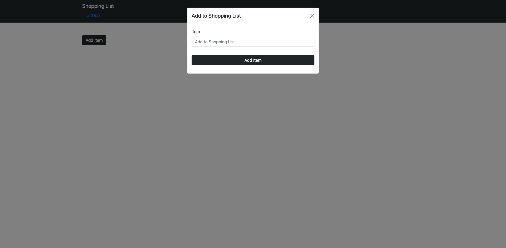

# Shopping List

## Description

This is a simple shopping list that allows you to put thing on the list and delete them when you are finished. When uyo click the add item button it will have a pop up modal to accept your items. When finished just click the red ex and it will be deleted. 

## Table of Contents

- [Description](#description)
- [Installation](#installation)
- [Usage](#usage)
- [License](#license)
- [Contributors](#contributors)
- [Tests](#tests)
- [Contact](#contact)

## Technologies used

- express
- mongoose
- dotenv
- axios
- redux
- react
- reactstrap

## Usage

To start the process, go to the deployed site [here](https://pure-retreat-51750.herokuapp.com/)

  

Screenshot

## License

Source link for [MIT](https://opensource.org/licenses/MIT)

## Contributors

Tim Davidson

## Tests

There are currently no tests for this application.  

## Contact

[GitHub Profile](https://github.com/timdavidson2)

Email Me -- timdavidson2@gmail.com